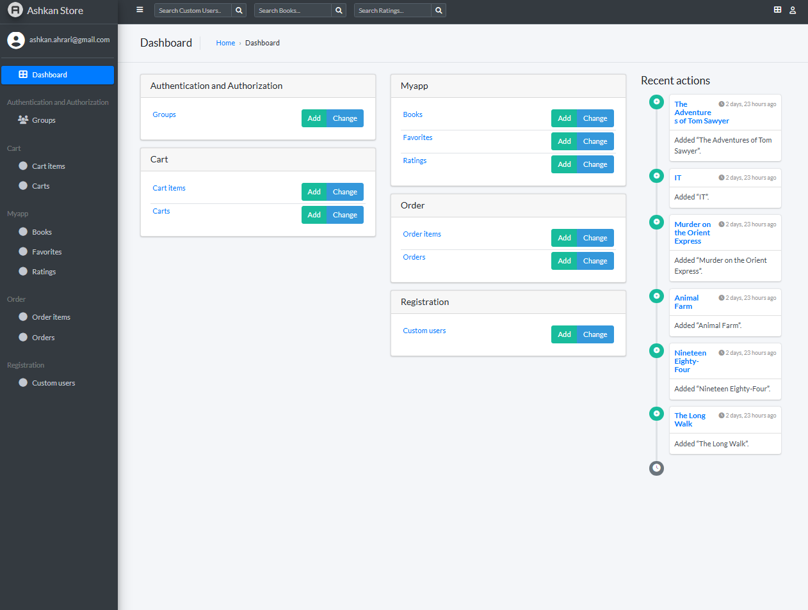

<p align="center">

</p>
# django-ecommerce-with-api

# 🛒 Enterprise E-Commerce Microservices API


A high-performance, containerized E-commerce backend designed for scalability. This project implements a modern **Microservices-ready architecture** using Django REST Framework, separating business logic into distinct domains (Product, Order, Payment, Recommendation).

## Key Features

### Backend & Architecture
* **RESTful API:** Fully documented API endpoints using **Django REST Framework (DRF)**.
* **Async Task Processing:** Integrated **Celery & Redis** to handle non-blocking operations (e.g., transaction emails, invoice generation).
* **Containerization:** Fully Dockerized environment (Web, DB, Redis, Worker) managed via `docker-compose`.
* **Production-Ready:** Configured with **Gunicorn** behind an **Nginx** reverse proxy for security and load balancing.

### Business Logic
* **Recommendation Engine:** Implements Collaborative Filtering (Surprise Library) to suggest products based on user behavior.
* **Payment Gateway:** Secure Stripe integration with webhook handling for real-time payment verification.
* **Secure Authentication:** JWT (JSON Web Token) authentication for stateless client-server communication.
* **Optimized Queries:** Utilizes `select_related` and `prefetch_related` to eliminate N+1 query problems.

---

## 🛠️ Tech Stack

| Component | Technology | Role |
| :--- | :--- | :--- |
| **Backend** | Python, Django, DRF | Core API Logic |
| **Database** | PostgreSQL | Relational Data Storage |
| **Caching/Queue** | Redis | Caching & Message Broker |
| **Async Tasks** | Celery | Background Worker |
| **Infrastructure** | Docker, Nginx | Containerization & Serving |
| **Testing** | Pytest | Automated Unit & Integration Tests |

---

## Quick Start (Docker)

The easiest way to run this project is using Docker. This ensures the environment matches production exactly.

1. **Clone the repository**
   ```bash
   git clone [https://github.com/AsHkAn-Django/django-ecommerce.git](https://github.com/AsHkAn-Django/django-ecommerce.git)
   cd django-ecommerce
   ```

2. **Configure Environment Create a .env file in the root directory:**

   ```Bash
   SECRET_KEY=your_secret_key_here
   DEBUG=1
   POSTGRES_DB=ecommerce_db
   POSTGRES_USER=postgres
   POSTGRES_PASSWORD=postgres
   REDIS_URL=redis://redis:6379/0
   ```

3. **Launch the Stack**
   ```Bash
   docker-compose up -d --build
   ```

4. **Run Migrations**
   ```Bash
   docker-compose exec web python manage.py migrate
   ```

The API will be available at http://localhost:8000/api/.
---

## Manual Installation (Localhost)
If you prefer running without Docker:

1. **Setup Virtual Environment**

   ```Bash
   python -m venv .venv
   source .venv/bin/activate  # Windows: .venv\Scripts\activate
   ```

2. **Install Dependencies**

   ```Bash
   pip install -r requirements.txt
   ```

3. **Run Migrations & Server**

   ```Bash
   python manage.py migrate
   python manage.py runserver
   ```

---

## Contact & Portfolio
Ashkan Ahrari - Backend & Deployment Specialist

Portfolio: [codewithashkan.com](https://codewithashkan.com/)

GitHub: [AsHkAn-Django](https://github.com/AsHkAn-Django)

LinkedIn: [Ashkan Ahrari](https://www.linkedin.com/in/ashkan-ahrari/)

I specialize in deploying scalable Django architectures. Open for contract and full-time backend roles.