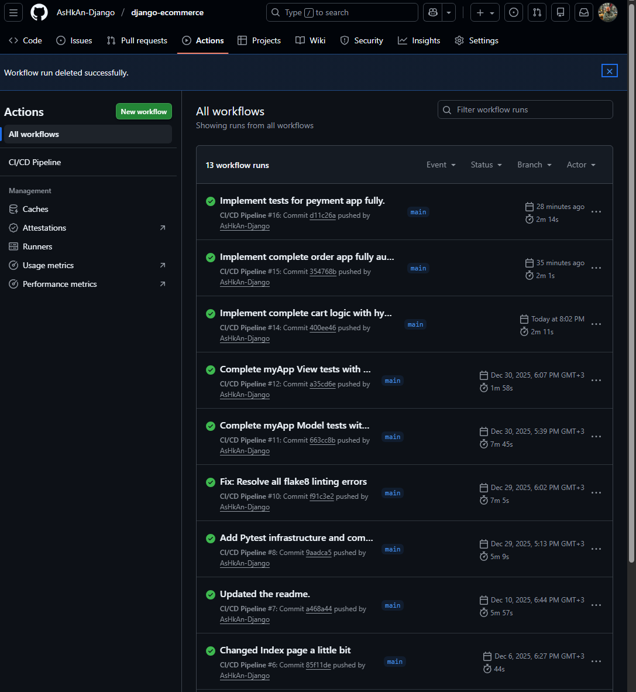

<p align="center">

</p>
# django-ecommerce-with-api

# 🛒 Enterprise E-Commerce Platform (Full Stack)

[](https://github.com/AsHkAn-Django/django-ecommerce/actions/workflows/deploy.yml)


A production-grade, containerized E-commerce platform designed for reliability and scale. This project goes beyond basic tutorials by implementing **DevOps best practices**, including a fully automated CI/CD pipeline, asynchronous background processing, and a strict TDD (Test Driven Development) approach.

## 🚀 Key Engineering Features

### DevOps & Architecture
* **Automated CI/CD Pipeline:** Built with **GitHub Actions**. Every push to `main` triggers:
    1.  **Linting:** Flake8 & Black for code quality.
    2.  **Testing:** Runs the full Pytest suite (135+ tests).
    3.  **Deployment:** If tests pass, it automatically SSHs into the VPS, pulls code, rebuilds Docker containers, and runs migrations.


* **Containerized Environment:** Fully Dockerized services (Web, Postgres, Redis, Celery Worker) orchestrated via `docker-compose`.
* **Production Serving:** Configured with **Gunicorn** behind an **Nginx** reverse proxy for security and load balancing.

### Backend Logic
* **Robust Payment System:** **Stripe** integration with **Webhooks** handling. It listens for server-side events to safely verify payments, clear carts, and trigger post-purchase workflows.
* **Async Processing:** Uses **Celery & Redis** to handle heavy tasks (PDF invoice generation, email sending) without blocking the main web thread.
* **Recommendation Engine:** Collaborative Filtering implementation to suggest products based on user purchase history.

### Frontend
* Includes a fully responsive frontend integrated directly with Django templates for a seamless user experience.

---


## 🛠️ System Architecture

| Component | Technology | Role |
| :--- | :--- | :--- |
| **App Server** | Django + Gunicorn | Core Application Logic |
| **Web Server** | Nginx | Reverse Proxy & Static Files |
| **Database** | PostgreSQL | Persistent Data Storage |
| **Cache/Broker** | Redis | Caching & Celery Message Broker |
| **Worker** | Celery | Background Task Processing |
| **PDF Engine** | WeasyPrint | Invoice Generation |

---

## 🧪 Testing Strategy

Quality is a priority in this project. The codebase is covered by **135+ automated tests** using `pytest`.

* **Unit Tests:** Covers Models, Serializers, and Utility functions.
* **Integration Tests:** Verifies Views, APIs, and Database transactions.
* **Edge Cases:** Tests stock limits, empty carts, and unauthorized access attempts.
* **Mocking:** External services (Stripe) are mocked to ensure fast and reliable test runs.

**Run the tests locally:**
```bash
docker-compose exec web pytest
```

---

## Quick Start (Docker)

The easiest way to run this project is using Docker. This ensures the environment matches production exactly.

1. **Clone the repository**
   ```bash
   git clone https://github.com/AsHkAn-Django/django-ecommerce.git
   cd django-ecommerce
   ```

2. **Configure Environment Create a .env file in the root directory:**

   ```Bash
   SECRET_KEY=your_secret_key
   DEBUG=1
   POSTGRES_DB=ecommerce_db
   POSTGRES_USER=postgres
   POSTGRES_PASSWORD=postgres
   REDIS_URL=redis://redis:6379/0
   STRIPE_SECRET_KEY=sk_test_...
   STRIPE_WEBHOOK_SECRET=whsec_...
   ```

3. **Launch the Stack**
   ```Bash
   docker-compose up -d --build
   ```

4. **Run Migrations**
   ```Bash
   docker-compose exec web python manage.py migrate
   ```

The API will be available at http://localhost:8000/api/.
---

## Manual Installation (Localhost)
If you prefer running without Docker:

1. **Setup Virtual Environment**

   ```Bash
   python -m venv .venv
   source .venv/bin/activate  # Windows: .venv\Scripts\activate
   ```

2. **Install Dependencies**

   ```Bash
   pip install -r requirements.txt
   ```

3. **Run Migrations & Server**

   ```Bash
   python manage.py migrate
   python manage.py runserver
   ```

---

## 📚 API Documentation

This project uses `drf-spectacular` to auto-generate interactive API documentation. You can test endpoints directly from your browser.

| Interface | URL | Description |
| :--- | :--- | :--- |
| **Swagger UI** | [http://localhost:8000/docs/](http://localhost:8000/docs/) | Interactive testing interface for developers. |
| **Redoc** | [http://localhost:8000/redoc/](http://localhost:8000/redoc/) | Clean, structured documentation for reading. |
| **Schema** | [http://localhost:8000/schema/](http://localhost:8000/schema/) | Raw OpenAPI 3.0 Schema (YAML). |

> **Note:** You must run the server (`python manage.py runserver` or via Docker) to access these links.


---

## Contact & Portfolio
Ashkan Ahrari - Backend & Deployment Specialist

Portfolio: [codewithashkan.com](https://codewithashkan.com/)

GitHub: [AsHkAn-Django](https://github.com/AsHkAn-Django)

LinkedIn: [Ashkan Ahrari](https://www.linkedin.com/in/ashkan-ahrari/)

I specialize in deploying scalable Django architectures. Open for contract and full-time backend roles.